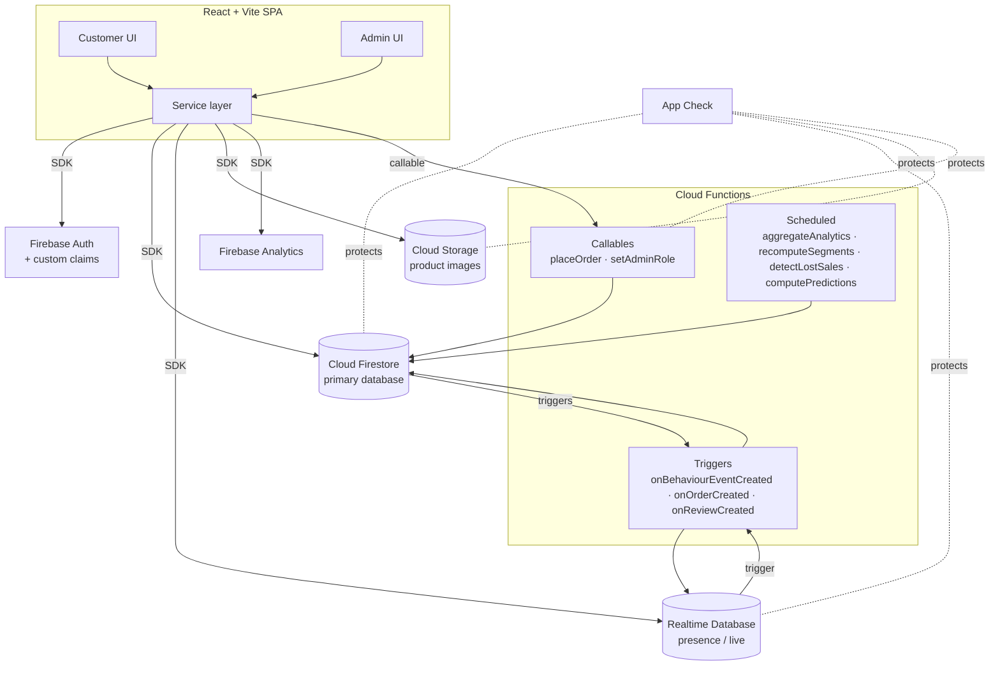
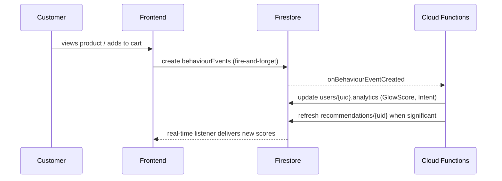
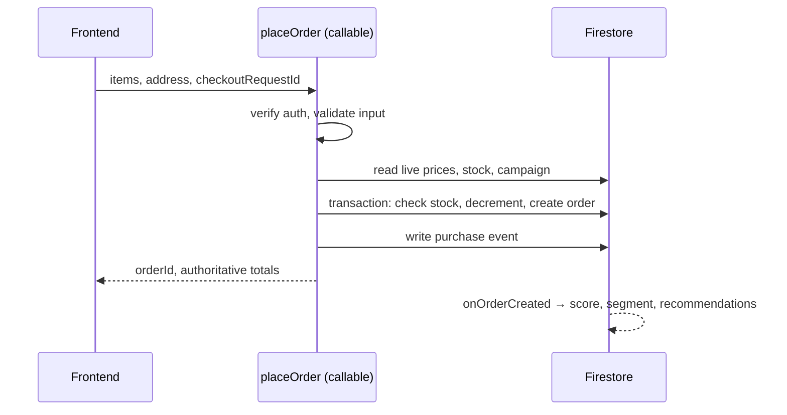

# Architecture

> How GlowShine Co. is put together: components, data flow, boundaries and the decisions behind them.
> Related: [Security](security.md) · [Authentication](auth.md) · [API](api.md) · [Realtime](realtime.md)

---

## 1. System Overview

GlowShine Co. is a single-page React application backed entirely by Firebase. Customers shop through a storefront while every meaningful action is recorded as a behaviour event. Cloud Functions turn those events into scores, segments, predictions and recommendations, which flow back to the customer UI and to the admin console.

```text
CUSTOMER SHOPPING → BEHAVIOUR EVENTS → FIREBASE → CLOUD FUNCTIONS
      → GlowScore · GlowIntent · GlowTrend → PERSONALISATION
      → Recommendations + Offers + Predictions → MORE PURCHASES → MORE DATA
```

### Design goals

| Goal | How the architecture serves it |
|---|---|
| Secure by design | Rules enforce access; all sensitive values are computed server-side |
| One deployment | Firebase end to end, no separate Python or Node server |
| Explainable intelligence | Rule-based scoring with a central config and visible reasons |
| Cheap to run | Dashboards read pre-aggregated snapshots, not raw events |
| Demo-ready | Reproducible seed script and Emulator Suite |

---

## 2. High-Level Architecture



---

## 3. Technology Stack

| Layer | Technology | Purpose |
|---|---|---|
| Framework | React + Vite | Fast SPA development and build |
| Styling | Tailwind CSS | Utility-first design system with shared tokens |
| Routing | React Router | Public, customer and admin route groups with guards |
| Language | JavaScript (TypeScript optional) | Application code |
| Charts | Recharts or Chart.js | Admin visualisations |
| Authentication | Firebase Authentication | Email/password, Google, custom claims |
| Primary database | Cloud Firestore | Products, users, orders, events, reviews, snapshots |
| Live database | Realtime Database | Presence and live activity only |
| Files | Cloud Storage | Product images |
| Backend logic | Cloud Functions for Firebase | Triggers, schedules, callables |
| Analytics | Firebase Analytics | Aggregate usage trends |
| Hosting | Firebase Hosting | Static SPA delivery |
| Tooling | Firebase Emulator Suite, Vitest, Playwright (optional) | Local development and testing |

---

## 4. Architecture Decision Records

| ADR | Decision | Rationale | Trade-off |
|---|---|---|---|
| 01 | Firebase end to end; no Flask/Python backend | Fewer moving parts; built-in auth and rules | Less flexibility for heavy analytics |
| 02 | Firestore primary; RTDB only for presence and live activity | Firestore for queries, RTDB for ephemeral state | Two databases to manage |
| 03 | All scores computed in Cloud Functions | Clients cannot tamper; one source of logic | Small latency; needs functions deployed |
| 04 | Firebase Analytics **and** Firestore `behaviourEvents` | GA for aggregates; Firestore for per-user logic and timelines | Minor event duplication |
| 05 | Orders created through callable `placeOrder` | Server re-prices and controls stock | More backend code than direct writes |
| 06 | Custom claims plus Security Rules for roles | Frontend checks are UX only | Claims need a bootstrap script |
| 07 | Rule-based recommendations | Transparent and quick to build | Less accurate than ML |
| 08 | Demo payment only | Avoids payment-compliance scope | Not production-ready |

---

## 5. Frontend Architecture

### 5.1 Layering

```text
UI components / pages
        ↓
Hooks and context (state, subscriptions)
        ↓
Service layer  (src/services/*)
        ↓
Firebase SDK
```

Components never import the Firebase SDK directly. Every read, write and callable goes through a service module. This keeps UI code testable, makes Firebase easy to mock, and gives one place to add error mapping, retries and event tracking.

### 5.2 Repository Structure

```text
glowshine-co/
├── src/
│   ├── components/          # shared UI: Navbar, ProductCard, KpiCard, Skeleton…
│   ├── layouts/             # CustomerLayout, AdminLayout
│   ├── pages/
│   │   ├── customer/        # Home, Shop, Product, Cart, Checkout, Orders, GlowMatch…
│   │   └── admin/           # Dashboard, Sales, Customers, Behaviour, Products…
│   ├── hooks/               # useAuth, useCart, useWishlist, useRecommendations…
│   ├── context/             # AuthContext, CartContext, ToastContext
│   ├── services/
│   │   ├── firebase/        # app init, emulator wiring, App Check
│   │   ├── auth/
│   │   ├── products/
│   │   ├── orders/          # wraps the placeOrder callable
│   │   ├── behaviour/       # event tracker (fire-and-forget)
│   │   └── analytics/       # admin snapshot readers
│   ├── utils/               # formatters, validators, error mapping
│   ├── data/                # static copy, constants
│   └── App.jsx
├── functions/src/
│   ├── behaviour/           # event trigger, GlowScore, GlowIntent
│   ├── recommendations/
│   ├── analytics/           # aggregation, trends, lost sales
│   ├── orders/              # placeOrder, onOrderCreated
│   ├── users/               # setAdminRole, segments, predictions
│   └── config/              # scoring weights and thresholds (single module)
├── scripts/                 # seed data, admin-claim bootstrap
├── firestore.rules · firestore.indexes.json
├── database.rules.json · storage.rules
├── firebase.json
└── README.md
```

### 5.3 Routing and Guards

| Group | Routes | Guard |
|---|---|---|
| Public | `/`, `/shop`, `/product/:id`, `/login`, `/register`, `/offers` | None |
| Customer | `/quiz`, `/glowmatch`, `/routine`, `/wishlist`, `/cart`, `/checkout`, `/orders`, `/profile`, `/journey` | Signed in |
| Admin | `/admin/**` | Signed in **and** `admin` claim |

Guards are UX only. The same restrictions are enforced by Security Rules.

### 5.4 State and Data Fetching

- **Auth state:** one `AuthContext` subscribed to `onIdTokenChanged`, exposing `user`, `isAdmin` and `loading`.
- **Cart and wishlist:** real-time listeners on the user's own document, with optimistic UI and rollback on failure.
- **Catalogue:** paginated Firestore queries (`where`, `orderBy`, `limit`, cursor) with skeleton loading.
- **Admin dashboards:** read `analyticsSnapshots`; never scan `behaviourEvents` in the browser.
- **Recommendations:** read `recommendations/{uid}`; if empty or failing, fall back to trending products so shopping never breaks.

### 5.5 UI State Contract

Every data view implements five states: **loading · success · empty · error · retry**. No blank screens while Firebase loads, and no raw Firebase error text on screen.

---

## 6. Backend Architecture

### 6.1 Function Catalogue

| Function | Type | Trigger | Responsibility |
|---|---|---|---|
| `onBehaviourEventCreated` | Firestore trigger | `behaviourEvents/{id}` created | Update counters, GlowScore, GlowIntent, product stats |
| `placeOrder` | Callable | Client | Validate, re-price, apply campaign, transactionally create order and decrement stock |
| `onOrderCreated` | Firestore trigger | `orders/{id}` created | Update spend, segment, prediction inputs, recommendations |
| `computeRecommendations` | Internal | After key events | Score products and write `recommendations/{uid}` |
| `recomputeSegments` | Scheduled (daily) | Cron | Re-evaluate segments and aggregates |
| `aggregateAnalytics` | Scheduled (hourly/daily) | Cron | Build `analyticsSnapshots` |
| `computePredictions` | Scheduled (daily) | Cron | GlowPredict per user |
| `detectLostSales` | Scheduled (hourly) | Cron | Flag high-intent users without purchase |
| `onReviewCreated` | Firestore trigger | `reviews/{id}` created | Sentiment, keywords, rating aggregate |
| `onCampaignWritten` | Firestore trigger | `campaigns/{id}` | Validate window, update status |
| `setAdminRole` | Callable / script | Admin or manual | Set custom claim |
| `syncPresence` | RTDB trigger | `presence/{uid}` | Maintain `liveActivity` aggregates |

### 6.2 Backend Principles

1. **Idempotent.** A retried trigger must not double-count. Use event-ID markers or deterministic document IDs.
2. **Authenticated.** Every callable checks `context.auth` and the role it needs.
3. **Configurable.** All weights and thresholds live in `functions/src/config`. Changing them requires no logic edits.
4. **Observable.** Scoring decisions log their inputs and outputs as structured JSON.
5. **Isolated failure.** A failing recommendation job must not break checkout or browsing.

---

## 7. Core Data Flows

### 7.1 Behaviour to Intelligence



Target latency: under 5 seconds typical, under 15 seconds worst case.

### 7.2 Checkout



### 7.3 Admin Insight Loop

```text
aggregateAnalytics (cron) → analyticsSnapshots → Admin dashboards
detectLostSales (cron)    → lost-sale alerts   → Admin creates campaign
campaign (status: active) → customer sees offer → placeOrder applies discount
```

---

## 8. Data Architecture

```text
Firestore
├── users/{uid}                         profile + server-written analytics
├── products/{productId}
├── categories/{categoryId}
├── brands/{brandId}
├── behaviourEvents/{eventId}           append-only
├── carts/{uid}
├── wishlists/{uid}/items/{productId}
├── orders/{orderId}                    created by placeOrder only
├── reviews/{reviewId}
├── recommendations/{uid}               server-written
├── segments/{segmentId}                server-written
├── campaigns/{campaignId}
├── analyticsSnapshots/{date}           server-written
└── auditLogs/{logId}                   server-written

Realtime Database: presence/{uid}, liveActivity/
Storage: /products/{category}/…, /user-assets/{uid}/…
```

### Single source of truth

| Data | Authority | Not stored elsewhere |
|---|---|---|
| Identity and roles | Firebase Auth (claims) | `users.role` is a display mirror only |
| Stock and price | `products` in Firestore | Never in RTDB or `localStorage` |
| Order totals and status | `orders` (server-written) | Cart totals are display-only |
| Scores and segments | `users/{uid}.analytics` | Computed only by Functions |
| Online presence | RTDB `presence` | Not duplicated into Firestore |

### Planned indexes

| Collection | Fields | Used for |
|---|---|---|
| `behaviourEvents` | `userId` ASC, `timestamp` DESC | Timelines, per-user scoring |
| `behaviourEvents` | `eventType` ASC, `timestamp` DESC | Admin aggregates |
| `behaviourEvents` | `productId` ASC, `eventType` ASC, `timestamp` DESC | Product analytics |
| `orders` | `userId` ASC, `createdAt` DESC | My Orders |
| `products` | `active`, `category`, `price` | Shop filters |
| `reviews` | `productId`, `createdAt` DESC | Product reviews |

---

## 9. Intelligence Engine

| Component | Output | Where it lives |
|---|---|---|
| **GlowScore** | 0–100 engagement and value score | `users/{uid}.analytics.glowScore` |
| **GlowIntent** | Rolling 7-day purchase intent (Low / Medium / High) | `analytics.purchaseIntent`, `intentBand` |
| **Segmentation** | Elite, Dormant, Loyal, Saver, Explorer, Care, Glam | `analytics.segment` |
| **GlowMatch** | Ranked products with match % and reasons | `recommendations/{uid}` |
| **GlowPredict** | Likelihood and timing of next repurchase | Per-user prediction fields |
| **GlowTrend** | 7-day vs previous 7-day growth | `analyticsSnapshots` |

```text
GlowScore = clamp(0..100,
    0.30 × Engagement + 0.30 × PurchaseIntent + 0.25 × Loyalty + 0.15 × Monetary)
```

The engine is **behaviour-based and rule-driven**. It is presented honestly as such and is not described as machine learning.

---

## 10. Environments and Deployment

| Environment | Purpose | Notes |
|---|---|---|
| **Local** | Development | Firebase Emulator Suite (Auth, Firestore, Functions, RTDB, Storage) |
| **Staging** | Pre-release verification | Separate Firebase project; rules and functions tested here first |
| **Production** | Live | Separate Firebase project; deploys only after the pipeline passes |

```text
Build → Lint → Unit tests → Rules tests (emulator) → Integration tests
      → Critical user-flow test → Deploy rules → Deploy functions → Deploy hosting
```

Never test experimental rules against production data. Use `firebase use <alias>` to switch projects.

---

## 11. Performance and Cost

| Concern | Approach |
|---|---|
| Firestore reads | Paginate; use `limit()`; dashboards read snapshots; avoid unbounded listeners |
| Images | Compressed WebP/JPEG, `loading="lazy"`, explicit dimensions |
| Bundle size | Route-level code splitting; admin bundle separate from customer bundle |
| Event writes | Debounced; fire-and-forget; never block the UI |
| Function cost | Idempotent, batched aggregations; hourly/daily schedules rather than per-event full scans |

Targets: catalogue first render under 2.5 s on broadband, Lighthouse Performance 80 or higher, score update under 5 s typical.

---

## 12. Reliability and Failure Handling

| Failure | Behaviour |
|---|---|
| Event write fails | Silent retry/skip; shopping continues |
| Recommendations unavailable | Fall back to trending products |
| Network offline / slow | Show retry state; preserve cart and form input |
| `placeOrder` fails | Clear message, no partial order, safe to retry (idempotent) |
| Token expired | Refresh token, otherwise redirect to login with message |
| Function trigger replayed | No double counting |

---

## 13. Real vs Simulated

| Capability | Status |
|---|---|
| Auth, catalogue, wishlist, cart, orders, behaviour tracking | **Real** |
| Scores, segments, recommendations, admin analytics | **Real** (computed from data) |
| Payment | **Simulated** (`paymentStatus: "demo"`, clearly labelled) |
| Shipping, SMS, email | **Simulated** |
| Sentiment, prediction | **Simulated** (rule-based, not ML) |

Simulated features are labelled in the UI and in the documentation.
