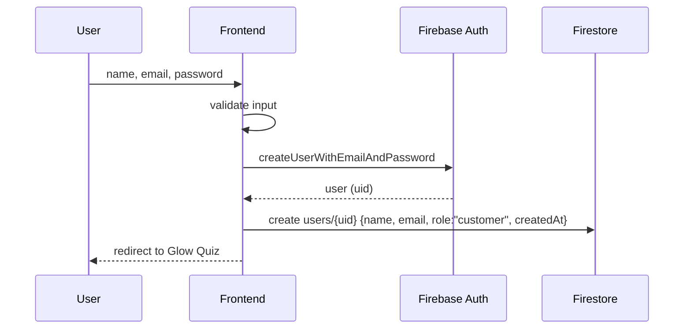

# Authentication and Authorization

> Identity, sessions, roles and route protection for GlowShine Co.
> Related: [Security](security.md) · [Architecture](architecture.md) · [API](api.md)

---

## 1. Overview

**Firebase Authentication is the single source of truth for identity.** Authorization (what an identity may do) is enforced by custom claims plus Security Rules. Frontend checks only decide what to *show*.

| Concern | Mechanism |
|---|---|
| Identity | Firebase Auth (email/password, Google) |
| Roles | Custom claims on the ID token (`admin`, reserved `superAdmin`) |
| Enforcement | Firestore / Storage / RTDB Security Rules and callable checks |
| UI gating | Route guards and conditional rendering (UX only) |
| Profile data | `users/{uid}` document |

---

## 2. Supported Sign-In Methods

| Method | Priority | Notes |
|---|---|---|
| Email and password | P0 | Registration, login, logout |
| Google Sign-In | P1 | Add the app domain to Authorized Domains and configure the OAuth consent screen |
| Password reset | P1 | Firebase-sent email; UI shows a neutral confirmation |
| Anonymous (pre-login tracking) | P2 | Optional; merged into the real account on sign-up via credential linking |

---

## 3. Roles

| Role | How it is granted | Can do |
|---|---|---|
| Visitor | Not signed in | Browse public catalogue |
| Customer | Default on registration | Own profile, cart, wishlist, orders, reviews |
| Admin | Claim `admin: true` | Product, campaign and order management, analytics |
| Super admin *(reserved)* | Claim `superAdmin: true` | Manage administrators and system settings |

**Rules for roles**

1. A role is **never** set from the client.
2. `users/{uid}.role` exists for display. Security decisions read `request.auth.token`, never that field.
3. Claims are set only by the bootstrap script or the admin-only `setAdminRole` callable.
4. Never use an email comparison such as `user.email === "admin@email.com"` for authorization.

---

## 4. Flows

### 4.1 Registration (email and password)



The create rule only accepts `role == 'customer'` and rejects any `analytics` field, so a hand-crafted request cannot self-promote.

```js
// src/services/auth/register.js (sketch)
import { createUserWithEmailAndPassword, updateProfile } from 'firebase/auth';
import { doc, setDoc, serverTimestamp } from 'firebase/firestore';
import { auth, db } from '../firebase';

export async function registerCustomer({ name, email, password }) {
  const { user } = await createUserWithEmailAndPassword(auth, email, password);
  await updateProfile(user, { displayName: name });
  await setDoc(doc(db, 'users', user.uid), {
    name,
    email,
    role: 'customer',
    createdAt: serverTimestamp(),
  });
  return user;
}
```

### 4.2 Login and Logout

- `signInWithEmailAndPassword` for login. `signOut` for logout.
- Persistence is `browserLocalPersistence`, so the session survives refresh.
- On logout: clear in-memory state, unsubscribe real-time listeners, and redirect protected routes to `/login`.

### 4.3 Google Sign-In

```js
import { GoogleAuthProvider, signInWithPopup, getAdditionalUserInfo } from 'firebase/auth';

const result = await signInWithPopup(auth, new GoogleAuthProvider());
if (getAdditionalUserInfo(result)?.isNewUser) {
  await createCustomerProfile(result.user); // same shape as email registration
}
```

First login creates `users/{uid}`. Later logins reuse it. If the popup is blocked, fall back to `signInWithRedirect`.

### 4.4 Password Reset

```js
await sendPasswordResetEmail(auth, email);
// Always show: "If an account exists for that email, a reset link has been sent."
```

The message is identical whether or not the account exists, which prevents account enumeration.

### 4.5 Admin Bootstrap

The first admin cannot be created from the app. Use a one-time script with the Admin SDK:

```js
// scripts/set-admin.js   usage: node scripts/set-admin.js <uid>
import { initializeApp, applicationDefault } from 'firebase-admin/app';
import { getAuth } from 'firebase-admin/auth';

initializeApp({ credential: applicationDefault() });
const uid = process.argv[2];
await getAuth().setCustomUserClaims(uid, { admin: true });
console.log(`Admin claim set for ${uid}`);
```

After the claim is set, the user must refresh their token (sign out and in, or `getIdToken(true)`) before it appears. Later admins can be added through the `setAdminRole` callable, which itself requires an existing admin (or super admin) caller.

---

## 5. Session and Token Handling

- The SDK manages ID tokens (about 1 hour) and refresh tokens automatically.
- The app subscribes to `onIdTokenChanged`, which fires on login, logout **and** token refresh, so claim changes are picked up.
- The claim is read from `getIdTokenResult()`.

```jsx
// src/context/AuthContext.jsx (sketch)
useEffect(() => {
  return onIdTokenChanged(auth, async (user) => {
    if (!user) { setState({ user: null, isAdmin: false, loading: false }); return; }
    const { claims } = await user.getIdTokenResult();
    setState({ user, isAdmin: claims.admin === true, loading: false });
  });
}, []);
```

| Situation | Behaviour |
|---|---|
| Page refresh | Session restored; show a loading skeleton, not a flash of the login page |
| Token expired and refresh fails | Redirect to `/login` with "Please sign in again." |
| Role changed server-side | Force `getIdToken(true)` or ask the user to sign in again |
| Logout in another tab | `onIdTokenChanged` fires; this tab redirects |

---

## 6. Route Protection

```jsx
function RequireAuth({ children }) {
  const { user, loading } = useAuth();
  const location = useLocation();
  if (loading) return <PageSkeleton />;
  if (!user) return <Navigate to="/login" state={{ from: location }} replace />;
  return children;
}

function RequireAdmin({ children }) {
  const { user, isAdmin, loading } = useAuth();
  if (loading) return <PageSkeleton />;
  if (!user || !isAdmin) return <Navigate to="/" replace />;
  return children;
}
```

| Route group | Guard | Also enforced by |
|---|---|---|
| Public | none | Rules allow public reads for active catalogue only |
| Customer (`/cart`, `/checkout`, `/orders`, `/profile`, …) | `RequireAuth` | Ownership rules (`request.auth.uid == uid`) |
| Admin (`/admin/**`) | `RequireAdmin` | `request.auth.token.admin == true` in rules and callables |

> A customer who types `/admin` is redirected in the UI **and** denied by the database. Both layers must hold.

---

## 7. Profile Data and Allowed Fields

| Field | Who may write | How |
|---|---|---|
| `name`, `beautyProfile` | Owner | Client, restricted by `hasOnly(['name','beautyProfile'])` |
| `role` | Nobody from the client | Set to `customer` at creation only |
| `analytics.*` | Cloud Functions | Admin SDK |
| `createdAt` | Creation only | Server timestamp |

Never allow customers to change `role`, `permissions`, `admin`, `isAdmin`, `createdAt` or any internal flag.

---

## 8. Error Handling

Map Firebase Auth errors to friendly, non-leaky messages. Do not reveal whether an email is registered at login.

| Firebase error code | Message shown |
|---|---|
| `auth/invalid-credential`, `auth/wrong-password`, `auth/user-not-found` | "Incorrect email or password." |
| `auth/email-already-in-use` | "An account with this email already exists. Try signing in." |
| `auth/weak-password` | "Choose a stronger password (at least 8 characters)." |
| `auth/invalid-email` | "Enter a valid email address." |
| `auth/too-many-requests` | "Too many attempts. Please wait a moment and try again." |
| `auth/popup-closed-by-user` | *(no message, user cancelled)* |
| `auth/network-request-failed` | "Connection problem. Check your internet and retry." |
| anything else | "Something went wrong. Please try again." |

Keep the user's typed form values on failure, and disable the submit button while a request is in flight to prevent duplicate submissions.

---

## 9. Password and Account Policy

- Minimum 8 characters; encourage a mix of character types, and show a strength hint.
- Enable email enumeration protection in the Firebase console where available.
- Never store passwords, tokens or credentials in `localStorage`, Firestore or logs.
- Account and data deletion requests are handled manually in the prototype.

---

## 10. Authentication Test Cases

| ID | Scenario | Expected |
|---|---|---|
| AUTH-01 | Register with valid details | Auth user and `users/{uid}` with `role: "customer"` |
| AUTH-02 | Register with a taken email | Friendly error; no duplicate profile |
| AUTH-03 | Log in, refresh the page | Session persists |
| AUTH-04 | Log out | Protected routes redirect to `/login` |
| AUTH-05 | First Google login | Profile created; second login reuses it |
| AUTH-06 | Reset password for unknown email | Same neutral message as a known email |
| AUTH-07 | Customer opens `/admin` | Redirected in UI; direct DB reads denied |
| AUTH-08 | Customer writes `role: "admin"` to own doc | Denied by rules |
| AUTH-09 | Customer calls `setAdminRole` | Rejected with `permission-denied` |
| AUTH-10 | Admin claim granted, user refreshes token | Admin UI becomes available |
| AUTH-11 | Expired session during checkout | Prompted to sign in; cart preserved |
