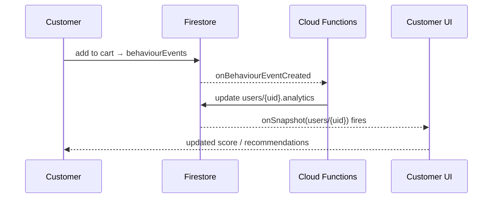

# Real-Time Features

> How GlowShine Co. delivers live data: Realtime Database for presence and live activity, and Firestore listeners for personal, always-fresh state.
> Related: [Architecture](architecture.md) · [Security](security.md) · [API](api.md)

---

## 1. When to Use What

| Need | Use | Why |
|---|---|---|
| Who is online, what area they are browsing | **Realtime Database** | Low-latency, ephemeral, supports `onDisconnect` |
| Aggregate live counters for admin | **Realtime Database** (`liveActivity`) | Cheap frequent updates |
| Cart contents, wishlist, orders | **Firestore** listener | Durable, queryable, secured per user |
| Scores, segment, recommendations | **Firestore** listener on `users/{uid}` / `recommendations/{uid}` | Updated by Cloud Functions |
| Admin KPIs and charts | **Firestore** reads of `analyticsSnapshots` | Pre-aggregated, no live scanning |

**Rule:** Realtime Database holds only data that genuinely needs real-time behaviour. Do not mirror Firestore collections into it. Product stock, prices and orders never live there.

---

## 2. Data Model

```json
{
  "presence": {
    "<uid>": { "online": true, "lastSeen": 1730000000000, "area": "skincare" }
  },
  "liveActivity": {
    "browsing": 28,
    "categories": { "skincare": 7, "makeup": 5, "haircare": 3 },
    "recentCarts": 3,
    "updatedAt": 1730000000000
  }
}
```

| Path | Writer | Reader | Purpose |
|---|---|---|---|
| `presence/{uid}` | The signed-in user (own node) | Admin | Online state, last seen, current browsing area |
| `liveActivity` | Cloud Functions only | Admin | Aggregates shown on the admin Live Activity panel |

`area` is a category slug (for example `skincare`) or `home`, `cart`, `checkout`. It never contains personal data.

---

## 3. Presence

### 3.1 Client behaviour

```js
// src/services/presence/presence.js (sketch)
import { ref, onValue, onDisconnect, set, serverTimestamp } from 'firebase/database';
import { rtdb, auth } from '../firebase';

export function startPresence(getArea) {
  const uid = auth.currentUser?.uid;
  if (!uid) return () => {};

  const myRef = ref(rtdb, `presence/${uid}`);
  const connectedRef = ref(rtdb, '.info/connected');

  const unsub = onValue(connectedRef, async (snap) => {
    if (snap.val() !== true) return;
    // Register the offline write FIRST, then mark online.
    await onDisconnect(myRef).set({ online: false, lastSeen: serverTimestamp(), area: null });
    await set(myRef, { online: true, lastSeen: serverTimestamp(), area: getArea() });
  });

  return () => {                       // call on logout / unmount
    unsub();
    set(myRef, { online: false, lastSeen: serverTimestamp(), area: null });
  };
}
```

| Behaviour | Detail |
|---|---|
| Start | After login; re-registers on every reconnect |
| Area updates | On route change (debounced), not on every scroll |
| Disconnect | `onDisconnect` marks the user offline even if the tab crashes |
| Logout | Mark offline, then stop the listener |
| Failure | Presence errors are swallowed; they must never affect shopping |

### 3.2 Privacy

- Only admins can read `presence`. Customers cannot see each other.
- Admin UI shows **counts and categories**, not names, in the Live Activity panel.
- Presence data is ephemeral and overwritten on each session.

---

## 4. Live Activity Aggregation

`syncPresence` is a Realtime Database trigger on `presence/{uid}`.

```text
presence/{uid} written
        ↓
syncPresence (Cloud Function)
        ↓
Recount: online users, per-category counts
        ↓
liveActivity updated
```

| Field | How it is computed |
|---|---|
| `browsing` | Number of `presence` nodes with `online == true` |
| `categories` | Count of online users per `area` |
| `recentCarts` | Count of `cart_add` events in the last 5 minutes (a scheduled job or event trigger writes this from Firestore) |
| `updatedAt` | Server time of the last recompute |

**Prototype scale:** recounting the `presence` tree on each write is acceptable for a few hundred users. If traffic grows, switch to transactional increments or a scheduled recompute (every 10–30 seconds).

**Staleness guard:** a node with `online == true` whose `lastSeen` is older than a threshold (for example 2 minutes) is ignored by the aggregation.

---

## 5. Security Rules

`database.rules.json` — closed by default, with explicit read, write and validate rules.

```json
{
  "rules": {
    ".read": false,
    ".write": false,

    "presence": {
      ".read": "auth != null && auth.token.admin === true",
      "$uid": {
        ".write": "auth != null && auth.uid === $uid",
        ".validate": "newData.hasChildren(['online', 'lastSeen'])",
        "online":   { ".validate": "newData.isBoolean()" },
        "lastSeen": { ".validate": "newData.isNumber()" },
        "area":     { ".validate": "newData.val() === null || (newData.isString() && newData.val().length <= 40)" },
        "$other":   { ".validate": false }
      }
    },

    "liveActivity": {
      ".read": "auth != null && auth.token.admin === true",
      ".write": false
    }
  }
}
```

Cloud Functions use the Admin SDK, which bypasses these rules, so `liveActivity` is writable only by trusted code. Test with the Emulator Suite: a customer must be unable to read `presence`, write another user's node, or write `liveActivity`.

---

## 6. Admin Live Activity Panel

Requirement **FR-ADM-14** (P2): show customers browsing now, customers per category, and carts created in the last 5 minutes, updating without a page refresh.

```jsx
// useLiveActivity.js (sketch)
useEffect(() => {
  const r = ref(rtdb, 'liveActivity');
  const off = onValue(r, (snap) => setState({ data: snap.val(), loading: false }),
                      (err) => setState({ error: err, loading: false }));
  return off;                                   // always unsubscribe
}, []);
```

| State | UI |
|---|---|
| Loading | Skeleton counters |
| No data | "No live activity right now." |
| Error | Friendly message with a retry control |
| Updated | Counters animate subtly; respect `prefers-reduced-motion` |

Only the admin Live Activity panel subscribes to `liveActivity`. The listener is removed when leaving the page.

---

## 7. Firestore Real-Time Listeners

Firestore `onSnapshot` powers the personal "it just updates" experience. Each listener has a reason, and each is unsubscribed on unmount.

| Listener | Purpose | Scope |
|---|---|---|
| `carts/{uid}` | Cart count in the navbar and cart drawer | Whole session |
| `wishlists/{uid}/items` | Heart state across product cards | Whole session |
| `users/{uid}` | Updated scores or segment | Profile / home only |
| `recommendations/{uid}` | New match list after an order or quiz | GlowMatch / home only |
| `orders` (own, `limit`) | Order status changes | Orders page only |

**Guidelines**

- Prefer one-off `getDoc` / `getDocs` for data that rarely changes (catalogue pages, snapshots).
- Never attach a listener to a whole collection without `where` and `limit`.
- Do not stack duplicate listeners on re-render; create them in effects with cleanup.
- Admin lists use paginated reads, not live listeners.

### The behaviour-to-UI loop



Target: score updates visible in under 5 seconds typical, under 15 seconds worst case.

---

## 8. Offline and Failure Behaviour

| Situation | Behaviour |
|---|---|
| Connection drops | Firestore serves cached reads; writes queue and sync on reconnect. UI shows a subtle "reconnecting" state |
| RTDB disconnect | `onDisconnect` marks the user offline; presence re-registers on reconnect |
| Listener error | Show a retry control; do not crash the page |
| Realtime Database unavailable | Admin panel shows "Live data unavailable." The rest of the dashboard still works |
| Event write fails | Skip silently; shopping continues |

---

## 9. Cost and Performance

- Presence writes are small and happen on connect, area change (debounced), and disconnect.
- `liveActivity` is a single small node, so admin reads are cheap.
- Avoid unbounded listeners; unsubscribe aggressively.
- Keep documents small. Do not put large arrays in a listened document.

---

## 10. Test Cases

| ID | Scenario | Expected |
|---|---|---|
| RT-01 | User signs in | `presence/{uid}.online` becomes `true` |
| RT-02 | Tab closed abruptly | Node becomes `online: false` through `onDisconnect` |
| RT-03 | Customer reads `presence` or `liveActivity` | Denied |
| RT-04 | Customer writes another user's presence node | Denied |
| RT-05 | Customer writes `liveActivity` | Denied |
| RT-06 | Presence write with extra field or non-boolean `online` | Rejected by `.validate` |
| RT-07 | Two users browse skincare, one browses makeup | `categories` shows 2 and 1 |
| RT-08 | Admin opens the Live Activity panel | Counters update without refresh |
| RT-09 | Leave the admin page | RTDB listener is removed |
| RT-10 | Go offline mid-session, reconnect | Cart and presence recover; no duplicate writes |
