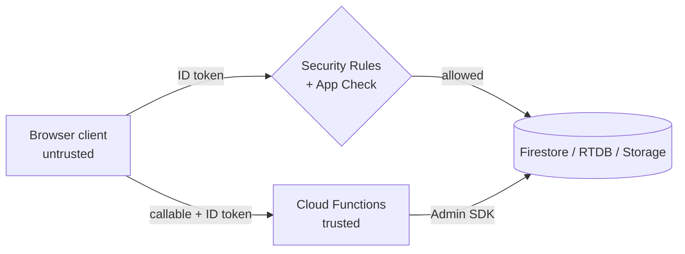

# Security

> GlowShine Co. security model: roles, rules, validation, secrets, and the test plan that proves them.
> Related: [Architecture](architecture.md) · [Authentication](auth.md) · [API](api.md) · [Realtime](realtime.md)

---

## 1. Security Principles

| # | Principle | In practice |
|---|---|---|
| 1 | **Deny by default** | Every Firestore, Storage and Realtime Database path starts closed; access is granted per path |
| 2 | **The frontend hides, the rules enforce** | Hiding an admin button is UX. Every admin operation must also fail when called directly |
| 3 | **Never trust the client** | Role, price, discount, stock, totals, payment status, scores and verification flags are decided server-side |
| 4 | **Server-controlled fields stay server-controlled** | `analytics.*`, `segments`, `recommendations`, `analyticsSnapshots` are written only by Cloud Functions |
| 5 | **Rules evolve with the schema** | A new collection is not done until it has an owner, read/write rules, validation, indexes and tests |
| 6 | **Test denials as hard as allowances** | Negative tests are mandatory (wrong owner, forged role, forged event) |

**Priority order when concerns conflict:** Security → Data correctness → Functionality → Performance → UX → Visual polish.

---

## 2. Roles and Trust Boundaries

| Role | Mechanism | Capabilities |
|---|---|---|
| **Visitor** | No authentication | Read active products, categories, brands |
| **Customer** | Authenticated, no admin claim | Own profile (limited fields), cart, wishlist; read own orders, events, recommendations; create own events and reviews |
| **Admin** | Custom claim `admin: true` | Manage products, categories, brands, campaigns; read all orders, customers, events, analytics, reviews; moderate reviews |
| **Super admin** *(reserved)* | Custom claim `superAdmin: true` | Everything an admin can do, plus manage administrators and system configuration |
| **Cloud Functions** | Admin SDK (bypasses rules) | Sole writer of analytics, segments, recommendations, snapshots; creates orders |



Everything left of the rules is untrusted. Everything that decides money, stock, roles or scores runs on the right.

---

## 3. Permission Matrix

| Resource | Visitor | Customer | Admin | Functions |
|---|---|---|---|---|
| `products` (active) | Read | Read | Read / Write | Write (stock, ratings) |
| `categories`, `brands` | Read | Read | Read / Write | – |
| `users/{uid}` | – | Read own; update `name`, `beautyProfile` only | Read all | Write `analytics` |
| `behaviourEvents` | – | Create own; read own | Read all | Read / Write |
| `carts/{uid}` | – | Read / Write own | Read | – |
| `wishlists/{uid}/items` | – | Read / Write own | Read | – |
| `orders` | – | Read own; create **via `placeOrder` only** | Read; status via admin callable | Create |
| `reviews` | Read approved | Create own (verified purchase) | Read / moderate | Write sentiment |
| `recommendations/{uid}` | – | Read own | Read | Write |
| `segments`, `analyticsSnapshots` | – | – | Read | Write |
| `campaigns` | – | Read active, matching | Read / Write | Update stats |
| RTDB `presence/{uid}` | – | Write own | Read all | Write `liveActivity` |
| Storage `/products/**` | Read | Read | Write | – |

---

## 4. Hardened Firestore Rules

The PRD's illustrative rules are the starting point. The version below closes three gaps found during analysis:

1. **Admin cart/wishlist access is read-only** (the PRD sketch grants admin write, which contradicts the matrix above).
2. **Event timestamps must equal server time**, so clients cannot back-date behaviour.
3. **Event payloads are shape-checked**, so clients cannot attach arbitrary fields.

```js
rules_version = '2';
service cloud.firestore {
  match /databases/{database}/documents {

    // ---------- helpers ----------
    function isSignedIn()  { return request.auth != null; }
    function isOwner(uid)  { return isSignedIn() && request.auth.uid == uid; }
    function isAdmin()     { return isSignedIn() && request.auth.token.admin == true; }

    function validEventType(t) {
      return t in ['page_view','search','category_view','product_view',
                   'wishlist_add','wishlist_remove','cart_add','cart_remove',
                   'checkout_start','review_submit','quiz_complete',
                   'routine_create','recommendation_click','offer_click'];
    }

    // ---------- catalogue ----------
    match /products/{id} {
      allow read:   if resource.data.active == true || isAdmin();
      allow create, update, delete: if isAdmin();
    }
    match /categories/{id} { allow read: if true; allow write: if isAdmin(); }
    match /brands/{id}     { allow read: if true; allow write: if isAdmin(); }

    // ---------- users ----------
    match /users/{uid} {
      allow read:   if isOwner(uid) || isAdmin();
      allow create: if isOwner(uid)
                    && request.resource.data.role == 'customer'
                    && !('analytics' in request.resource.data);
      allow update: if isOwner(uid)
                    && request.resource.data.diff(resource.data)
                         .affectedKeys().hasOnly(['name', 'beautyProfile']);
      allow delete: if false;
    }

    // ---------- behaviour events (append-only) ----------
    match /behaviourEvents/{id} {
      allow create: if isSignedIn()
                    && request.resource.data.userId == request.auth.uid
                    && validEventType(request.resource.data.eventType)
                    && request.resource.data.timestamp == request.time
                    && request.resource.data.keys().hasOnly(
                         ['userId','eventType','productId','category','query',
                          'value','meta','sessionId','timestamp']);
      allow read:   if isAdmin()
                    || (isSignedIn() && resource.data.userId == request.auth.uid);
      allow update, delete: if false;
    }

    // ---------- commerce ----------
    match /carts/{uid} {
      allow read:  if isOwner(uid) || isAdmin();
      allow write: if isOwner(uid);
    }
    match /wishlists/{uid}/items/{pid} {
      allow read:  if isOwner(uid) || isAdmin();
      allow write: if isOwner(uid);
    }
    match /orders/{id} {
      allow read: if isAdmin() || (isSignedIn() && resource.data.userId == request.auth.uid);
      allow create, update, delete: if false;   // placeOrder / admin callable only
    }

    // ---------- reviews ----------
    match /reviews/{id} {
      allow read: if true;
      // Verified-purchase check is enforced in a callable or via a
      // function-written flag. Direct client creates stay closed until then.
      allow create, update, delete: if false;
    }

    // ---------- server-written ----------
    match /recommendations/{uid} { allow read: if isOwner(uid) || isAdmin(); allow write: if false; }
    match /segments/{id}         { allow read: if isAdmin(); allow write: if false; }
    match /analyticsSnapshots/{id} { allow read: if isAdmin(); allow write: if false; }

    // ---------- campaigns ----------
    match /campaigns/{id} {
      allow read:  if isAdmin() || resource.data.status == 'active';
      allow write: if isAdmin();
    }

    // ---------- everything else is closed ----------
    match /{document=**} { allow read, write: if false; }
  }
}
```

**Notes**

- `purchase` events are written by the server and are intentionally absent from `validEventType`.
- Queries on `products` must include `where('active', '==', true)` for non-admins, or the list request is denied.
- Do **not** add a catch-all like `allow read, write: if request.auth != null`. Overlapping `match` blocks are OR-ed, so a broad rule silently overrides the specific ones.
- Review creation is closed on purpose. Open it only through a callable that verifies a delivered/confirmed order for that product.

---

## 5. Storage Rules

```js
rules_version = '2';
service firebase.storage {
  match /b/{bucket}/o {

    function isAdmin() { return request.auth != null && request.auth.token.admin == true; }
    function validImage() {
      return request.resource.contentType.matches('image/(jpeg|png|webp)')
          && request.resource.size < 2 * 1024 * 1024;   // 2 MB
    }

    match /products/{category}/{file} {
      allow read:  if true;
      allow write: if isAdmin() && validImage();
    }
    match /user-assets/{uid}/{file} {
      allow read:  if request.auth != null && request.auth.uid == uid;
      allow write: if request.auth != null && request.auth.uid == uid && validImage();
    }
    match /{allPaths=**} { allow read, write: if false; }
  }
}
```

Validate **type, size, ownership and path** on every write. Never ship `allow read, write: if true`.

---

## 6. Realtime Database Rules

See [realtime.md](realtime.md#5-security-rules) for the full ruleset. In short: root is closed, `presence/{uid}` is writable only by its owner and readable only by admins, and `liveActivity` is written only by Cloud Functions.

---

## 7. Server-Side Trust: Orders, Stock and Pricing

The checkout path is the most sensitive transaction in the system.

| Client sends | Server decides |
|---|---|
| `productId`, `quantity`, `address`, `checkoutRequestId` | `unitPrice`, `discount`, `delivery`, `total`, `campaign eligibility`, `remaining stock`, `paymentStatus`, `status` |

`placeOrder` must:

1. Reject unauthenticated calls (`context.auth` required).
2. Validate input shape, quantity range, and address fields.
3. Read current prices and stock from Firestore, never from the cart document.
4. Apply a campaign only if the server confirms it is active, in-window and targeted at this user or segment.
5. Run **one transaction** that checks stock, decrements it, and creates the order, so two buyers cannot both take the last unit.
6. Be **idempotent**: derive the order ID from `uid + checkoutRequestId` so a retry or double-click returns the existing order instead of creating a second one.
7. Write the `purchase` event server-side.

Stock can never go negative. A failed transaction leaves stock and orders untouched.

---

## 8. Input Validation

Validate at three layers. The frontend is a convenience; the other two are the security boundary.

| Layer | Purpose | Examples |
|---|---|---|
| Frontend | Fast feedback | Email format, pincode length, required fields |
| Cloud Functions | Authoritative business validation | Quantity 1–10, valid product IDs, address schema, enum values |
| Security Rules | Last line of defence at the database | Allowed fields, allowed event types, ownership |

Validate: required fields, data types, string lengths, numeric ranges, IDs, enum values, ownership, role, file type and file size.

---

## 9. Secrets and Configuration

| Item | Where it lives | Notes |
|---|---|---|
| Firebase web config (`apiKey`, `projectId`, …) | `.env` → `VITE_FIREBASE_*` | Identifies the project; **not** a secret, but restrict the key by HTTP referrer in Google Cloud Console |
| Service account key | Never in the repo | Use `GOOGLE_APPLICATION_CREDENTIALS` locally only for scripts |
| Function config / third-party keys | Firebase Functions secrets (`firebase functions:secrets:set`) | Never in frontend code, Firestore, or RTDB |
| `.env`, `*.json` keys | `.gitignore` | Commit `.env.example` with empty values |

Never store passwords, tokens, payment details or private keys anywhere in the app, including `localStorage`. `localStorage` may hold only UI preferences (theme, last-used filters).

---

## 10. App Check and Abuse Protection

- Enable **Firebase App Check** (reCAPTCHA Enterprise or v3 for web) on Firestore, Storage, Realtime Database and Cloud Functions.
- App Check **complements** Authentication and Rules; it never replaces them.
- Event writes: client-side debounce (no duplicate `product_view` for the same product within 30 seconds) plus the append-only rule.
- Callables: rate limit per UID (for example, a short cooldown on `placeOrder`), and reject oversized payloads.

---

## 11. Privacy

- Collect only what the product needs. No payment card data, no government IDs.
- Show a short privacy notice at registration explaining that browsing behaviour powers personalisation.
- Behaviour data is used inside the app for recommendations and analytics only.
- Admin dashboards use aggregates (`analyticsSnapshots`) wherever possible. Customer detail views show only what an admin needs.
- Customers can request account and data deletion (manual process acceptable for the prototype).
- Private pages (`/cart`, `/checkout`, `/orders`, `/profile`, `/admin/**`) carry `noindex` and are excluded from the sitemap.
- Recommendations avoid sensitive inferences. Skin preferences come from what the customer chose in the quiz, and the UI never makes medical claims.

---

## 12. Logging and Audit

**Never log** passwords, ID tokens, payment data, private keys or sensitive personal information.

**Do log** (structured JSON): function name, userId, decision inputs and outputs for scoring, order IDs, and errors with stack traces.

**Audit trail** for admin actions: write to an `auditLogs` collection (admin-read, function-write only).

```js
{ adminId, action: "product.deactivate", targetId, timestamp, actionType }
```

Destructive actions (delete product, delete campaign, cancel order, delete user data) require confirmation in the UI **and** an authorisation check on the server, and they are audit-logged.

---

## 13. User-Facing Error Policy

Raw Firebase errors never reach the screen.

| Internal | Shown to the customer |
|---|---|
| `permission-denied` | "You don't have access to this." |
| `unauthenticated` | "Please sign in again to continue." |
| `failed-precondition` (stock) | "Some items are no longer available in that quantity." |
| `unavailable`, timeout | "We couldn't reach the server. Please try again." |
| anything else | "Something went wrong. Please try again." |

Technical details go to the console/logging layer only.

---

## 14. Security Test Plan

Run in the **Firebase Emulator Suite** with `@firebase/rules-unit-testing`. Rules are not considered done until the allow *and* deny cases pass.

Test every path as: **unauthenticated · customer · wrong-owner customer · admin · superAdmin · invalid payload · expired session**.

| ID | Scenario | Expected |
|---|---|---|
| TC-01 | Customer reads another user's cart, orders or events | Denied |
| TC-02 | Customer sets `role: "admin"` or edits `analytics` | Denied |
| TC-03 | Non-admin reads admin data directly | Denied |
| TC-04 | Cart with tampered price sent to `placeOrder` | Server price is charged |
| TC-05 | Order exceeds stock | Rejected with a clear message |
| TC-06 | Two simultaneous orders for the last unit | Exactly one succeeds |
| TC-13 | Event logging fails while offline | Shopping continues, no UI error |
| TC-14 | Function trigger replayed | No double counting |
| SEC-A | Client creates an event with a past `timestamp` | Denied |
| SEC-B | Client creates a `purchase` event | Denied |
| SEC-C | Client updates or deletes an event | Denied |
| SEC-D | Customer uploads to `/products/**` | Denied |
| SEC-E | Upload of a 5 MB file or a non-image | Denied |
| SEC-F | Double-click on "Place order" | One order only |

---

## 15. Pre-Launch Security Checklist

- [ ] No open rules (`if true`) on any production path
- [ ] Firestore, Storage and RTDB rules deployed and tested in the emulator
- [ ] Admin claim can only be set through the bootstrap script or `setAdminRole`
- [ ] App Check enabled and enforced
- [ ] API key restricted by referrer; no secrets in the repo or client bundle
- [ ] `placeOrder` re-prices and is idempotent; stock transaction verified
- [ ] Separate dev / staging / production Firebase projects
- [ ] Private routes marked `noindex`
- [ ] Error messages sanitised; logs contain no secrets
- [ ] Demo payment clearly labelled as simulated in the UI
